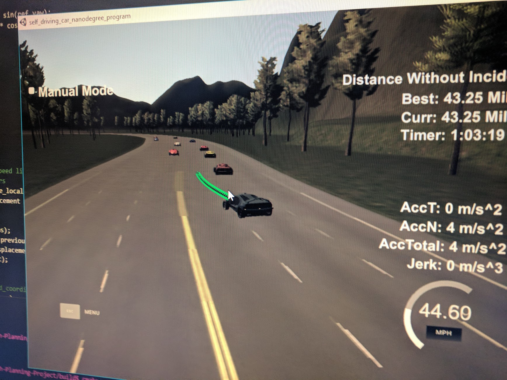

# Path Planning Project

This `README.md` document describes how the specific ruberic points were achieved, and describes the code model for generating the paths in detail.

## Individual Rubric Points

> **The car is able to drive at least 4.32 miles without incident..**
> The top right screen of the simulator shows the current/best miles driven without incident. Incidents include exceeding acceleration/jerk/speed, collision, and driving outside of the lanes. Each incident case is also listed below in more detail.

The car has driven for over an hour without an incident. The only incidents were when a car from oncoming traffic had an accident and skidded into the ego car's lane.


>  **The car drives according to the speed limit.**
> The car doesn't drive faster than the speed limit. Also the car isn't driving much slower than speed limit unless obstructed by traffic.

To address this rubric point, I have included the following logic , which will accelerate the car at a rate of `throttle_acceleration` by changing the reference velocity (`ref_vel_mps`) until the target velocity (45 Mph, `target_vel_mps`) is met, unless the car is too close to another vehicle, as indicated by the `too_close` flag, in which case the car will brake at its `brake_acceleration`. (`main.cpp` lines 330-324):

```c++
if (too_close){
    ref_vel_mps -= brake_acceleration * time_between_waypoints;
    ...
} else if (ref_vel_mps < target_vel_mps){
    ref_vel_mps += throttle_acceleration * time_between_waypoints;
    ...
}
```

>  **Max Acceleration and Jerk are not Exceeded.**
> The car does not exceed a total acceleration of 10 m/s$^2$ and a jerk of 10 m/s$^3$.

A generally smooth path was created by using the `spline.h` library, which used sparse points defined by the map and the desired lane to create a smooth connecting path. Once a spline-based path had been created, the path was sanitized so that the total acceleration never exceeded 10 m/s$^2$. For every candidate waypoint (`x_point_world`, `y_point_world`) after the second, the following logic was implemented to sanitize the path: A null point in space (`x_null_2`, `y_null_2`) was defined, such that it would be the location of the car if it continued along the heading established by the previous waypoints without any acceleration. (Kinematic equation given by $x_f=x_i+v_x \cdot \Delta t$) Then, so long as the magnitude of the acceleration was in excess of that allowed, the candidate waypoint was brought closer to the point followed by the 0 acceleration path by a factor less than 1 (`bring_back_ratio`=10%). By limiting the range of possible accelerations, jerk is also limited, since if it went from 0 to max acceleration over the course of a single time step, it would still be within tolerances. (`main.cpp` lines 428 - 465):

```c++
if (num_added_vals > 2){
    ...
    double x_null_2 = x_1 + v_x_0 * time_between_waypoints;
    double y_null_2 = y_1 + v_y_0 * time_between_waypoints;
    ...
    while(a_mag_0 > max_allowed_a){
        x_point_world = x_point_world + bring_back_ratio * (x_null_2 - x_point_world);
        y_point_world = y_point_world + bring_back_ratio * (y_null_2 - y_point_world);
        ...
    }
```

> **Car does not have collisions.**
> The car must not come into contact with any of the other cars on the road.

The throttle/brake logic from above means that the car will not rear-end another car. Furthermore, the checks for whether adjacent lanes are clear ensures that lane changes are done safely. The car does not avoid being rear-ended itself, and although it is somewhat tolerant to collisions from other cars entering its lane, they have on occasion resulted in a collision. For each car, it is determined whether it too close, or would block a lane change. That is done with the following code (`main.cpp` lines 315-327):
```c++
if (in_same_lane){
    if (behind_sensed_car && within_unsafe_range){
        too_close = true;
    }
}

if (in_lane_to_left && within_blocking_distance){
    open_on_left = false;
}

if (in_lane_to_right && within_blocking_distance){
    open_on_right = false;
}
```

> **The car stays in its lane, except for the time between changing lanes.**
> The car doesn't spend more than a 3 second length out side the lane lanes during changing lanes, and every other time the car stays inside one of the 3 lanes on the right hand side of the road.

 An individual lane is followed by generating a path of constant $d$ and increasing $s$ in Fresnet coordinates, which can then be converted to absolute coordinates. Those are then used as the sparse waypoints for the spline. The distance between the points defining the spline has been tuned so that the lane change is done efficiently.

 > **The car is able to change lanes.**
 > The car is able to smoothly change lanes when it makes sense to do so, such as when behind a slower moving car and an adjacent lane is clear of other traffic.
 
 The $d$ Fresnet coordinate of the waypoints defining the spline depend on which lane is the target. (`d` is given by `lane_width * (0.5 + lane)`; See lines 388-390 of `main.cpp`) Whether the lane should be changed is determined by whether the car is too close to the car in front of it, and whether it is open on the left or open on the right. This results in lane changes to open lanes. (`main.cpp` lines 330-339)

 ```c++
if (too_close){
    ...
    if(open_on_left){
        lane -= 1;
    } else if(open_on_right){
        lane += 1;
    }
} ...
 ```